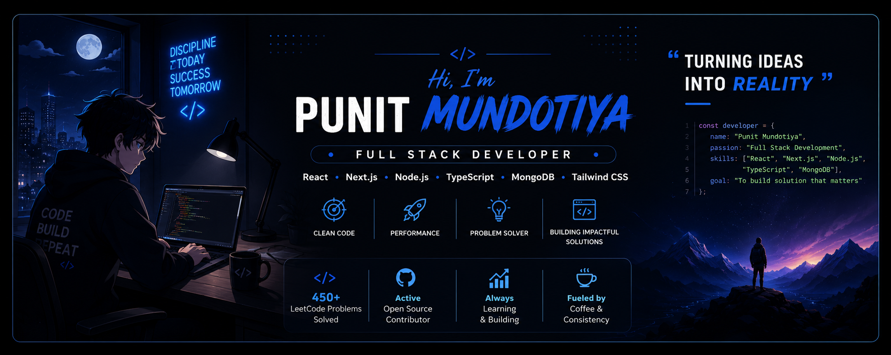

  

<h1 align="center">Hi 👋, I'm Punit Mundotiya</h1>

<h3 align="center">
Full Stack Developer from India 🇮🇳
</h3>

## 🚀 About Me

🎓 B.Tech Information Technology @ NIT Srinagar

💻 Full Stack Developer

🔥 Solved 450+ LeetCode Problems

🌱 Currently Learning
- Next.js
- TypeScript
- System Design

⚡ Building Modern Web Applications

## 🌐 Connect With Me

  

  

  

  

  

 
## 🛠 Tech Stack
## 🛠 Tech Stack

## 🛠 Tech Stack

