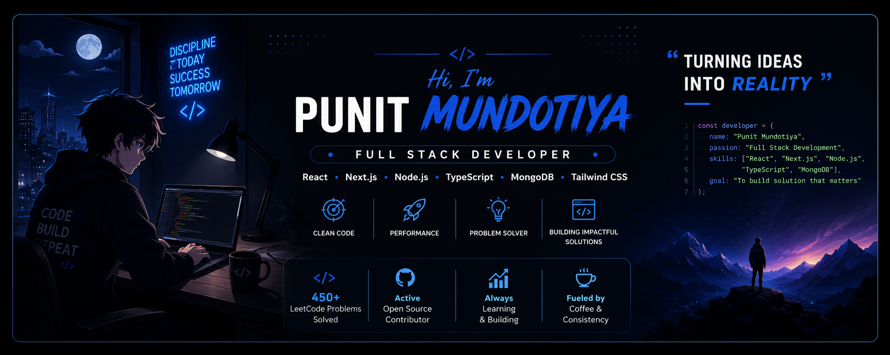

  

# Hi 👋, I'm Punit Mundotiya

🎓 B.Tech in Information Technology @ NIT Srinagar (2024–2028)

💻 Full Stack Developer interested in building web applications.

🧠 1100+ LeetCode problems solved | 1750+ rating

### Tech Stack

- C++
- Java
- JavaScript
- TypeScript
- React.js
- Next.js
- Node.js
- Express.js
- Spring Boot
- PostgreSQL
- MongoDB
- Git & GitHub

### Projects

- **HCR Textile** — Full-stack e-commerce website using Next.js, MongoDB and Cloudinary.
- **BajriX Marketplace** — Marketplace built with React, Spring Boot and PostgreSQL.
- **Velozity Dashboard** — Full-stack project dashboard using React, Node.js, PostgreSQL and Prisma.

### Connect With Me

---

  <b>Keep building. Keep solving. 🚀</b>

